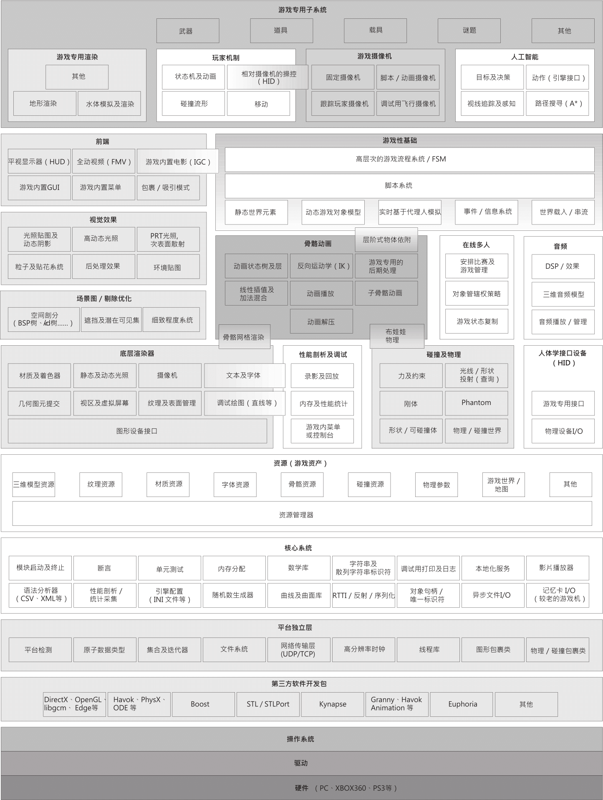

###《游戏引擎架构》读书笔记
最近开始读Milo翻译的**《Game Engine Architecture》**，希望能够在还剩下一年的学生阶段中，尽可能在进入职场前了解游戏开发以及游戏引擎的方方面面，从研二开始才真正接触图形学，图形引擎，瞬间点燃了我的学习热情，期间，了解过Opengl，认真学习了D3D11，钻研了OGRE，玩了UE4，但是慢慢地我发现，一个完整的游戏(这里仅仅指端游)或游戏引擎，是一个对于现在我来说过于“可怕”的庞然大物，仅仅通过零散时间的学习零散的知识点，始终无法能够在脑海中建立起一个游戏开发的完整呈象。一方面当然是接触时间还太短，另一方面也是很重要的一方面，是因为自己对于软件工程的概念太过于模糊，因此除了好好学习《设计模式》和《代码大全》这一类提高自己对于软件架构和软件工程高层次的认识，还需要对于游戏开发和游戏引擎有一个具体的认识，这也是我读这本书的出发点，希望记录下每当有所领悟时，自己的理解。

首先，还是先贴出一张引擎的架构图，从而时时刻刻在脑海中刻下一个印记，然后从方方面面去深入：

* #####P8 电子游戏作为软实时模拟
电子游戏本质，实际上是**软实时**(soft real-time)**互动**(interactive)**基于代理**(agent-based)的**计算机模拟**(compter simulation)
___

* #####P10 游戏引擎是什么
**数据驱动架构**(data-driven architecture)或许可以用来分辨一个软件的哪些部分是引擎，哪些部分是游戏.
其实读过以后才认识到，其实游戏引擎与游戏之间界限是很模糊的，并且，不同类型游戏的引擎，其差异也很大，关键是技术的侧重点不同，典型的例子，FPS(CS)，MMO(WOW)，格斗类游戏(铁拳)，竞速类游戏(极品飞车)，实时策略游戏(星际)，RPG(FF系列)，体育(FIFA)等等。
___

* #####P27 运行时引擎架构
本节十分精彩，Jason通过简练的语言将一个庞大的系统架构描述出来，让我对游戏引擎有一个整体的概览和认识，具体细节由上面的图片可以有一个清晰的认识。
让我感触最深的是，图形，虽然是游戏中很重要的一个部分，但，远远远远不是全部。
凭着我对本节的认识，还有
`AI，网络，动画，物理，音乐，视频，资产(材质，纹理，骨骼，动画，shader)`
___

* #####P54 游戏开发中，常用的版本控制系统
 * **SCCS**,**RCS**
 * **CVS**
 * **Git**
 * **Subversion(SVN)**
 * **Perforce**
 * **NxN Alienbrain**
 * **ClearCase**
___

* #####P88 游戏中最常用的设计模式
 * **单例：**常用于构建引擎的各个子系统
 * **迭代器:**用于遍历游戏中大量的对象，需要十分高效的实现
 * **抽象工厂：**用于常见和管理游戏中的各类对象：玩家角色，AI，相机，游戏中的各类物体，资源如纹理，贴花，阴影等等，甚至是碰撞用的射线、包围盒等等
___

* #####P92 浮点计法
浮点数是被**量化**的，浮点数的组成，IEEE-754：**符号位(1bit)**|**指数(8bit)**|**尾数(23bit)**
`v = Sx2^(e-127)x(1+m)`
以前一直没有好好的理解浮点数这个基本的只是，借着本节好好复习和巩固了浮点数的构成，明白了其**范围和精度的取舍**，也名表了**32位机器的epsilon`(1.192x10^-7)`由来**，因此在游戏编程中，判断某对象的速度是否为零时：
应该是`if(v < epsilon)`而不是`if(v == 0.0f)`
___

* ##### P118 捕捉及处理错误
错误的捕捉和处理，一直是自己平时编码和写程序中，最最忽视掉的环节
